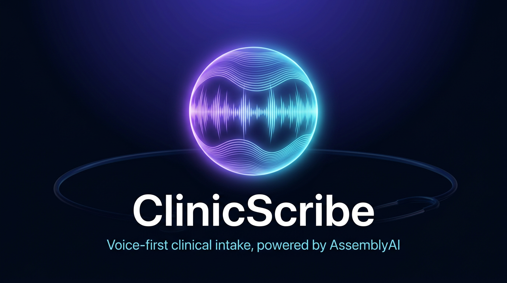

<p align="center">
  
</p>

<h1 align="center">🩺 ClinicScribe</h1>

<p align="center">
  <strong>A production-hardened, real-time voice agent for clinical pre-visit intake —<br>
  patients talk, the agent listens, structures, and hands off clean notes.</strong>
</p>

<p align="center">
  <a href="https://lablab.ai/ai-hackathons/assemblyai-voice-agent-hackathon">
    
  </a>
  
  
  
  <a href="render.yaml">
    
  </a>
</p>

> **⚕️ Compliance notice:** ClinicScribe is a hackathon prototype. It does not ship with a BAA,
> and it is not HIPAA/GDPR compliant as-is. **Never send real patient data (PHI/PII) through this
> demo deployment.** See [Business value → roadmap](#-business-value--roadmap) for the compliance path.

---

## 🏆 Hackathon entry

| | |
| --- | --- |
| **Event** | [AssemblyAI Voice Agent Hackathon](https://lablab.ai/ai-hackathons/assemblyai-voice-agent-hackathon) (lablab.ai × AssemblyAI) |
| **Dates** | September 1–30, 2026 · online · month-long |
| **Submission deadline** | **Sep 30, 11:00 AM EDT** |
| **Prize pool** | $10,000 — five winners, $1,000 cash + $1,000 API credits each |
| **Challenge path** | **Voice Agent API** — end-to-end voice agent through a single WebSocket connection (Universal-3 Pro STT, LLM routing, voice output, turn-taking, VAD) |
| **Stack** | AssemblyAI Voice Agent API · Node.js 22 · Express 5 · Web Audio (AudioWorklet) · vanilla JS · Render |

Judging criteria and how this repo answers them: [👇 Judging alignment](#-judging-alignment).
Copy-paste-ready submission fields (title, short/long description, tags, video + slide outlines): **[docs/submission.md](docs/submission.md)**.

---

## 💡 Why ClinicScribe

Clinicians burn **~2 hours on documentation for every 1 hour of direct patient care** — and front-desk
staff repeat the same intake questions hundreds of times a week. Intake is structured, predictable,
and voice-friendly… which makes it the perfect job for a voice agent.

**ClinicScribe** is a browser-native intake concierge. A patient opens the page (or kiosk), taps
**Start call**, and simply *talks*: reason for visit, symptoms, medications, allergies, insurance,
scheduling preferences. The AssemblyAI-powered agent conducts a natural, interruptible conversation,
and the full transcript stream is captured live — the raw material for structured notes, triage flags,
and EHR imports.

The hard part of a voice-agent demo isn't the demo — it's **shipping it safely**. ClinicScribe's
backend is built so the AssemblyAI API key never leaves the server, so casual abuse is rate-limited,
and so every replicated demo fork is safe to share publicly. That engineering is documented below.

## ✨ Features

- 🎙️ **One-click voice calls in the browser** — mic capture with echo cancellation, noise suppression,
  and auto-gain control; no app install, no phone line.
- 🧠 **AssemblyAI Voice Agent API end-to-end** — speech-to-text, agent reasoning, voice output,
  turn-taking, and interruptions handled inside one WebSocket connection.
- 🔐 **Zero-trust token flow** — the API key lives only on the server; browsers receive single-use,
  **60-second** session tokens with a **30-minute** call cap.
- ⚡ **Sub-second interruption handling** — queued agent audio is dropped the moment the patient
  barges in (`reply.done: interrupted`), exactly like a human conversation.
- 📉 **Cost & abuse controls baked in** — 5 call-starts per IP per 15 minutes, origin allowlisting,
  strict CSP, `session.end` on hang-up so the billable resume window never lingers.
- 🎨 **Polished call UX** — pulsing live orb, call timer, live dual-speaker transcript (capped at
  100 lines for DOM health), mute, graceful end-of-call states — all dependency-free static assets
  with gzip + smart cache headers.
- 🧪 **Tested audio pipeline** — `node --test` coverage of the 24 kHz PCM worklet resampler,
  including the pass-through fast path and overflow clamping.

## 🧭 Architecture

```text
┌────────────────────────┐   POST /api/voice-token   ┌─────────────────────────────┐
│                        │ ─────────────────────────▶│  Node 22 · Express 5         │
│   Browser client        │   60 s single-use token   │  (this repo, on Render)      │
│   public/app.js         │ ◀─────────────────────────│  server.js                   │
│                        │   { token, maxSession… }  │                              │
│  AudioWorklet 24 kHz    │                           │  helmet CSP · rate limit     │
│  PCM16 → base64         │                           │  origin check · compression  │
└─────────┬──────────────┘                           └──────────────┬──────────────┘
          │                                                         │
          │        wss://agents.assemblyai.com/v1/ws?token=…        │  mints tokens via
          │ ─ ─ ─ ─ ─ ─ ─ ─ ─ ─ ─ ─ ─ ─ ─ ─ ─ ─ ─ ─ ─ ─ ─ ─ ─ ─ ▶  │  official Node SDK
          │                                                         ▼
          │                                            ┌─────────────────────────────┐
          │        session.update → agent_id           │   AssemblyAI Voice Agent     │
          │        input.audio → PCM16 base64          │   stored agent               │
          │        reply.audio → speaker playback      │   (voice, prompt, tools      │
          │        transcript.user / transcript.agent  │    live in the AssemblyAI    │
          └ ─ ─ ─ ─ ─ ─ ─ ─ ─ ─ ─ ─ ─ ─ ─ ─ ─ ─ ─ ─ ─ │    project dashboard)        │
                   session.end on hang-up              └─────────────────────────────┘
```

**Key property:** call audio flows **directly browser ⇄ AssemblyAI**. Render only serves the static
app and mints tokens — so the free-plan sleep timer can never drop an in-progress call, and token
minting latency is a single lightweight HTTP round-trip.

## 🎙️ How AssemblyAI is used (Application of Technology)

ClinicScribe takes the **Voice Agent API** path of the hackathon challenge:

| Step | Where | Detail |
| --- | --- | --- |
| Token minting | `server.js` | `GET https://agents.assemblyai.com/v1/token` with `expires_in_seconds=60` and `max_session_duration_seconds=1800`, Bearer-authenticated — the documented pattern for the Voice Agent API |
| Connect | `public/app.js` | `new WebSocket("wss://agents.assemblyai.com/v1/ws?token=…")` |
| Bind agent | `public/app.js` | `session.update` with the stored `agent_id` on socket open |
| Mic uplink | `public/pcm-processor.js` | Float32 → **24 kHz, mono, signed PCM16** → base64 `input.audio` frames |
| Agent downlink | `public/app.js` | `reply.audio` PCM16 scheduled gaplessly on a Web Audio timeline |
| Interruption | `public/app.js` | `reply.done: interrupted` → all queued sources stopped aggressively |
| Transcripts | `public/app.js` | `transcript.user` / `transcript.agent` rendered via safe `textContent` |
| Hang-up | `public/app.js` | `session.end` (+ socket close + track stop + AudioContext close) |

## 🗂️ Project structure

```text
.
├── server.js                  # Hardened Express token server + static host
├── package.json               # Node 22, ESM, pinned deps, npm start/test scripts
├── package-lock.json
├── render.yaml                # Render Blueprint (one-click infra)
├── .env.example               # ASSEMBLYAI_API_KEY / PUBLIC_ORIGIN / PORT
├── public/
│   ├── index.html             # Call UI shell (orb, timer, transcript, controls)
│   ├── styles.css             # Dark glass UI, reduced-motion friendly, mobile-first
│   ├── app.js                 # Session state machine, WebSocket protocol, playback engine
│   ├── pcm-processor.js       # AudioWorklet: 24 kHz PCM16 with linear-resample fallback
│   └── favicon.svg
├── scripts/
│   ├── import-agent.mjs       # npm run import <agent_id> — rewire the Voice Agent ID
│   └── verify-pcm.mjs         # node --test unit tests for the PCM worklet
└── docs/
    ├── cover.png              # Hackathon cover image (also the README hero)
    ├── submission.md          # Copy-paste hackathon submission fields
    └── handoff.md             # Full scoping conversation with AssemblyAI's agent
```

## 🚀 Local development

**Requirements:** Node.js 22 (see `.nvmrc`) and an AssemblyAI API key with **Voice Agent access**
(claim hackathon credits via the signup link on the
[hackathon page](https://lablab.ai/ai-hackathons/assemblyai-voice-agent-hackathon)).

```bash
npm ci
cp .env.example .env
# edit .env: set ASSEMBLYAI_API_KEY (leave PUBLIC_ORIGIN=http://localhost:3000)
npm start
```

Open <http://localhost:3000>, allow microphone access, press **Start call**.

> **Bring your own agent:** the client binds to a stored agent via the `AGENT_ID`
> constant at the top of `public/app.js`. To point the app at any other agent in
> *your* AssemblyAI project, run:
>
> ```bash
> npm run import <agent_id>
> # e.g. npm run import agent_b0aca15004de4ab2b39bbfc1ce360956
> ```
>
> The script validates the ID format, rewrites the one line in `public/app.js`,
> and is a no-op if the agent is already active — then commit the change.
> The voice, greeting, system prompt, and tools all live on the agent, not in this repo.

Run checks without starting the server:

```bash
npm test     # node --check on all JS + unit tests for the PCM resampler
```

## 🔧 Environment variables

| Variable | Required | Description |
| --- | --- | --- |
| `ASSEMBLYAI_API_KEY` | ✅ | Server-side AssemblyAI API key. **Secret — never committed, never sent to browsers.** |
| `PUBLIC_ORIGIN` | Recommended | Exact browser origin allowed to mint tokens, e.g. `https://clinicscribe.onrender.com`. **No trailing slash.** Leave as `http://localhost:3000` locally. |
| `PORT` | No | Injected by Render in production; defaults to `3000` locally. |

---

## ☁️ Deploying to Render — the full walkthrough

This repo ships a ready blueprint ([`render.yaml`](render.yaml)). Two ways to deploy:
**A. Blueprint (recommended)** or **B. Manual web service**. Both end at the same place.

### 0 · Prerequisites

1. A [Render](https://render.com) account (free plan works).
2. An **AssemblyAI API key** with Voice Agent enabled (hackathon credits link on the event page).
3. Your **stored agent ID** (from the AssemblyAI dashboard) set as `AGENT_ID` in `public/app.js`.
4. This repository pushed to GitHub (public for the hackathon submission).

### A · Blueprint deploy (recommended — uses `render.yaml`)

1. Render dashboard → **New +** → **Blueprint**.
2. Connect your GitHub account if prompted, then select the **ClinicScribe** repo.
   Render auto-detects `render.yaml` and shows the service plan:
   `web · node · plan: free · region: oregon · branch: main ·
   build: npm ci · start: npm start · health check: /health · auto-deploy on commit`.
3. Click **Apply**. Render asks for the two `sync: false` secrets:
   - `ASSEMBLYAI_API_KEY` → paste your key (this is why it's `sync: false` — it never enters Git).
   - `PUBLIC_ORIGIN` → **leave blank for this first deploy**; you'll fill it in step 7.
4. Wait for the build. First deploy ≈ 2–4 minutes (`npm ci` → `npm start`).
5. When the service shows **Live**, note its origin — e.g. `https://clinicscribe.onrender.com`.
6. Open `https://<your-service>.onrender.com/health` → expect `{"status":"ok"}`.
7. **Lock down token minting (important):** in the Render dashboard → your service →
   **Environment** → set
   `PUBLIC_ORIGIN = https://<your-service>.onrender.com`
   (exact origin: `https`, no path, **no trailing slash**).
8. Render redeploys automatically on the env change (or trigger **Manual Deploy → Deploy latest
   commit**).

### B · Manual web service (no blueprint)

1. Render dashboard → **New +** → **Web Service** → connect the repo.
2. Fill the form exactly:

   | Field | Value |
   | --- | --- |
   | Name | `clinicscribe` (anything unique) |
   | Region | Oregon (or nearest to you) |
   | Branch | `main` |
   | Runtime | **Node** |
   | Build Command | `npm ci` |
   | Start Command | `npm start` |
   | Instance Type | Free (upgrade for always-on) |

3. **Health Check Path** (under Advanced): `/health`.
4. **Environment Variables:**

   | Key | Value |
   | --- | --- |
   | `ASSEMBLYAI_API_KEY` | your key (mark *secret*) |
   | `PUBLIC_ORIGIN` | leave blank, then set to the exact HTTPS origin after deploy |
   | `NODE_VERSION` | `22` |

   > ⚠️ **Do not set `PORT`** — Render injects it and `server.js` already honors it.
5. **Create Web Service**, wait for **Live**, then do step 7 from section A (set `PUBLIC_ORIGIN`).

### ✅ Post-deploy verification checklist

```bash
curl -i https://<your-service>.onrender.com/health            # → 200 {"status":"ok"}
curl -i -X POST -H "Origin: https://<your-service>.onrender.com" \
     https://<your-service>.onrender.com/api/voice-token      # → 200 {"token": "…", "maxSessionDurationSeconds": 1800}
curl -i -X POST -H "Origin: https://evil.example" \
     https://<your-service>.onrender.com/api/voice-token      # → 403 Origin not permitted
# repeat the valid POST 6+ times → 429 Too many call attempts
```

Then in the browser (Chrome/Edge/Safari, HTTPS required for mic):

- [ ] Page loads; orb is idle; no console errors.
- [ ] **Start call** → agent greets you; both transcript lines stream in.
- [ ] Interrupt the agent mid-sentence → its queued audio stops instantly.
- [ ] **Mute** toggles the uplink; **End call** returns UI to idle (server sends `session.end`).
- [ ] Render logs show no `voice_token_failed` entries.

### 🩹 Troubleshooting

| Symptom | Cause & fix |
| --- | --- |
| `403 Origin not permitted` on Start | `PUBLIC_ORIGIN` doesn't match the browser origin **exactly** (scheme, host, no trailing slash). Custom domain? Update it to the custom origin. |
| `429` on Start | Rate limit: 5 call-starts / 15 min / IP. Wait, or restart a fresh browser profile/network. |
| `session.error` right after connect | The `AGENT_ID` in `public/app.js` doesn't belong to the same AssemblyAI project as `ASSEMBLYAI_API_KEY`. |
| Mic button does nothing locally | Mic requires HTTPS or `localhost`. Use `http://localhost:3000`, not a LAN IP. |
| First page load takes ~50 s | Free-plan cold start after 15 min idle. Calls already in progress are unaffected (audio goes browser⇄AssemblyAI directly). Upgrade the plan for always-on. |
| Build fails on `npm ci` | Ensure `package-lock.json` is committed and `NODE_VERSION=22` is set. |

### 🔁 Updates & rollback

- **Auto-deploy** is on (`autoDeployTrigger: commit`): push to `main` → new build.
- Roll back from the Render dashboard → **Events/Deploys** → **Redeploy** a previous build.
- Adding a custom domain: configure it in Render, then immediately update `PUBLIC_ORIGIN`.

---

## 🔒 Security model

Layered, defense-in-depth — and honest about its limits:

- **Key isolation:** the AssemblyAI key exists only inside the Render environment; browsers only
  ever receive single-use, 60-second tokens.
- **Abuse controls on the billable route:** `POST /api/voice-token` is origin-allowlisted
  (`Origin` + `Sec-Fetch-Site` checks) and rate-limited (5 / 15 min / IP, draft-8 `RateLimit` headers).
- **Strict headers:** Helmet CSP (`connect-src 'self' wss://agents.assemblyai.com`, no inline
  scripts/styles, `object-src 'none'`, `frame-ancestors 'none'`), gzip compression, `no-store`
  on token responses, `no-cache` on `index.html`.
- **Safe rendering:** transcripts use `textContent` nodes only — no `innerHTML` injection surface.
- **Clean lifecycle:** graceful `SIGTERM`/`SIGINT` shutdown, 62 s keep-alive tuned above common
  60 s proxy timeouts, `trust proxy = 1` for Render's single ingress hop.

> ⚠️ **Known limits (stated for judges):** the in-memory limiter resets on restart and isn't shared
> across scaled instances, and origin checks are not authentication. For a public beta, add user
> auth and a distributed limiter store.

## 📉 Performance & cost controls

- 24 kHz `AudioContext` requested up-front → zero-resample fast path; linear fallback otherwise.
- Mic + AudioWorklet are prepared **before** minting the 60 s token → tokens are redeemed instantly.
- Calls hard-capped at 30 minutes (`maxSessionDurationSeconds`), client-side timer auto-hangs up.
- Client sends `session.end`, stops media tracks, disconnects nodes, closes the AudioContext.
- Transcript DOM is capped at 100 rendered lines for long-call stability.

## 🧪 Testing

```bash
npm test    # node --check server.js + public JS;  node --test scripts/verify-pcm.mjs
```

Unit tests cover the PCM worklet: 24 kHz pass-through, 48 kHz → 24 kHz resampling, and int16
overflow clamping. Manual smoke script lives in the
[post-deploy checklist](#-post-deploy-verification-checklist).

## 🧭 Judging alignment

| Criterion | How ClinicScribe answers it |
| --- | --- |
| **Application of Technology** | Voice Agent API integrated the idiomatic way: server-side temporary-token minting via the Voice Agent REST endpoint, browser-direct WebSocket media plane, stored-agent binding, full event protocol (audio, transcripts, interruptions, session lifecycle) — [details](#-how-assemblyai-is-used-application-of-technology). |
| **Presentation** | Polished single-page call UX, cover image, architecture diagram, full reproducible deploy, submission copy + video/slide outlines in [docs/submission.md](docs/submission.md). |
| **Business Value** | Attacks the documentation/intake burden in outpatient clinics: fewer front-desk phone hours, structured pre-visit data, better triage; deployable by any clinic with a browser — see roadmap below. |
| **Originality** | Not a demo-quality sandbox: production-minded controls (single-use 60 s tokens, origin allowlist, rate limits, cost caps, interruption-correct playback) packaged as a forkable reference for *any* Voice Agent API product. |

## 🗺️ Business value & roadmap

ClinicScribe's wedge is **pre-visit intake for outpatient clinics** — a high-volume, low-risk,
structured conversation. The path from hackathon to product:

1. ✅ **M0 — this repo:** hardened voice-agent web client + token server.
2. **M1 — Structured notes:** extract chief-complaint/symptom/med/allergy entities from the
   transcript stream (AssemblyAI LLM Gateway) into FHIR-compatible JSON.
3. **M2 — Auth & compliance:** staff/patient authentication, BAA + HIPAA controls, PHI redaction,
   audit logging, distributed rate limiting.
4. **M3 — EHR integration:** SMART on FHIR write-back; scheduling tools via the agent's
   JSON-Schema tool calling.
5. **M4 — Omnichannel:** phone-line intake (Realtime STT path), multilingual intake, kiosk mode.

## 📚 Resources

- [AssemblyAI docs](https://www.assemblyai.com/docs) ·
  [Voice Agent API](https://www.assemblyai.com/docs/voice-agents/voice-agent-api) ·
  [Realtime STT](https://www.assemblyai.com/docs/streaming/getting-started/transcribe-streaming-audio) ·
  [LLM Gateway](https://www.assemblyai.com/docs/llm-gateway/quickstart) ·
  [quickstarts](https://github.com/AssemblyAI)
- [Hackathon event page](https://lablab.ai/ai-hackathons/assemblyai-voice-agent-hackathon) ·
  [guidelines](https://lablab.ai/ai-articles/hackathon-guidelines) ·
  [rule book](https://lablab.ai/hackathon-rules)
- [Render Blueprint docs](https://render.com/docs/blueprint-spec)
- Build log & decisions: [docs/handoff.md](docs/handoff.md)

## 📄 License

[MIT](LICENSE) — original work, hackathon-compliant. Built with
[AssemblyAI](https://www.assemblyai.com/) Voice AI infrastructure for the
[lablab.ai](https://lablab.ai) AssemblyAI Voice Agent Hackathon, September 2026.
